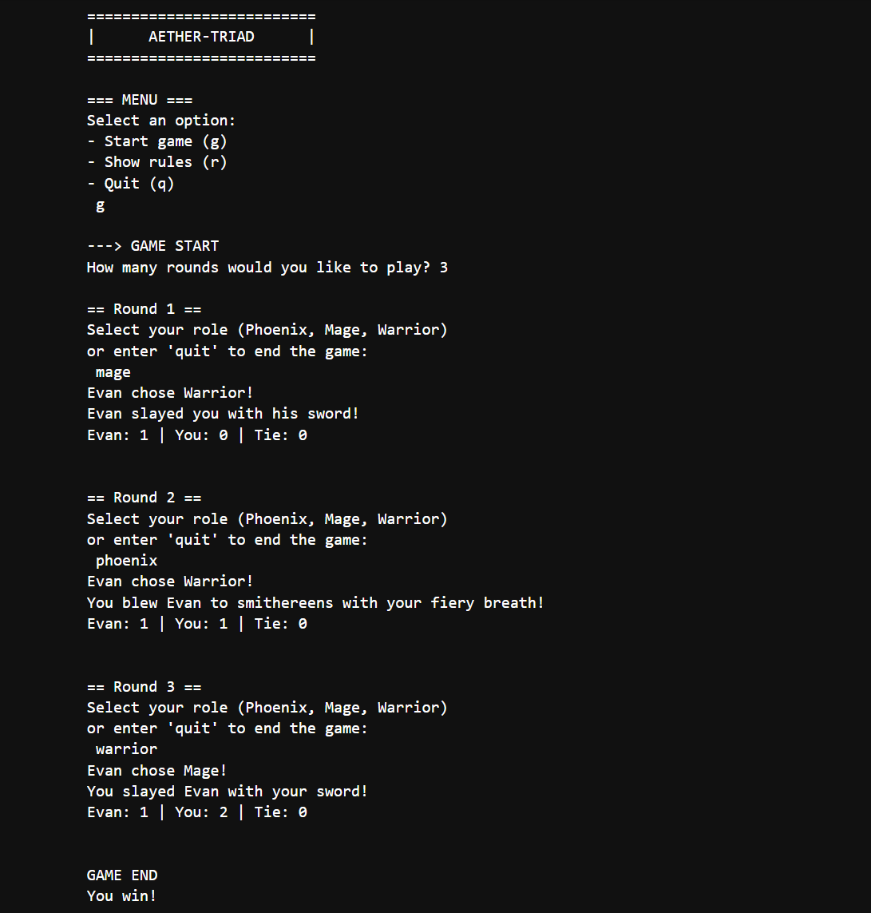

# Aether-Triad: Python Logic Simulator
Aether-Triad is a terminal-based program built to demonstrate clean code practices, user input handling, and game logic in Python. It uses a "rock-paper-scissors" style relationship between three fantasy roles—the Phoenix, the Mage, and the Warrior—to create a functional, interactive simulation.

## How It Works
The program is built around a triad logic model, where each role has a specific strength and weakness:
* **Phoenix** defeats **Warrior**
* **Warrior** defeats **Mage**
* **Mage** defeats **Phoenix**

## Technical Highlights
* **Input Validation:** The script is designed to be "crash-proof." It uses while loops and string methods like .isdigit() and .lower() to ensure the program doesn't break if a user enters an invalid command or number.
* **Modular Code:** Instead of one long script, the logic is broken into small, reusable functions (like print_rules, start_game, and play_game). This makes the code easier to read and debug.
* **Global State Management:** I used global variables to track scores (wins, losses, ties) across multiple rounds, ensuring the data remains accurate until the session ends.
* **Randomized Opponent:** The computer opponent ("EVAN") uses Python's random library to make unpredictable moves, testing the player's strategy.

## Key Programming Concepts Used
* **Loops & Conditionals:** Managing multi-round gameplay and win/loss logic.
* **Functions & Documentation:** Using clear function names and docstrings to explain what each part of the code does.
* **Global vs. Local Scope:** Understanding how to pass data between different parts of a program.
* **User Experience (UX):** Creating a simple, text-based menu system that is easy for a user to navigate.

## Future Plans
* **Refactoring to OOP:** Moving from procedural functions to a Class-based structure to practice Object-Oriented Programming.
* **Web Version:** Eventually turning this logic into a web app using a framework like Flask or React.
