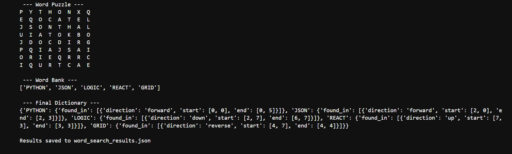

# Lexical Pattern-Matching Engine
Lexical Pattern-Matching Engine is a Python-based utility designed to automate the process of solving word-grid puzzles. By parsing external data files and executing a multi-directional search algorithm, the engine identifies the exact coordinates and orientation of specific strings within a two-dimensional character matrix.

## Technical Overview
The engine operates by transforming a raw text-based grid into a 2D list (matrix) architecture. It then performs an exhaustive search across four primary axes:
* Horizontal: Forward (Left-to-Right) and Reverse (Right-to-Left).
* Vertical: Downward and Upward.
Once a match is identified, the system calculates the start and end coordinates [row, col] and exports the entire dataset into a structured JSON format for easy integration with other tools.

## Key Features
* File Parsing & Data Normalization: Automatically reads and cleans data from wordpuzzle.txt and wordbank.txt, handling line breaks and formatting to build a reliable search grid.
* Modular Search Logic: Uses nested helper functions (search_forward, search_up, etc.) to keep the codebase organized and maintainable.
* Coordinate Mapping: Precisely calculates the index positions of strings, providing a "direction and location" dictionary for every found word.
* JSON Export: Rather than just printing to the console, the results are serialized into a word_search_results.json file, demonstrating data persistence.


## Sample JSON Output
When the engine completes its run, it generates a structured report like the one below:

```JSON
{
    "PYTHON": {
        "found_in": [
            {
                "direction": "down",
                "start": [0, 4],
                "end": [5, 4]
            }
        ]
    }
}
```

## Programming Concepts Demonstrated
* 2D Array Manipulation: Navigating rows and columns using nested loops and index offsets.
* File I/O: Reading from .txt files and writing structured data to .json.
* Dictionary Management: Building complex, nested JSON-style objects in Python.
* Algorithmic Logic: Implementing sliding-window comparisons to find specific patterns within a larger dataset.

## Future Enhancements
* Diagonal Search Support: Expanding the logic to include all 8 compass directions.
* Time Complexity Optimization: Implementing a Trie (prefix tree) to allow for faster searching in much larger grids.
* GUI Integration: Creating a visual interface to display the grid and highlight found words in real-time.
